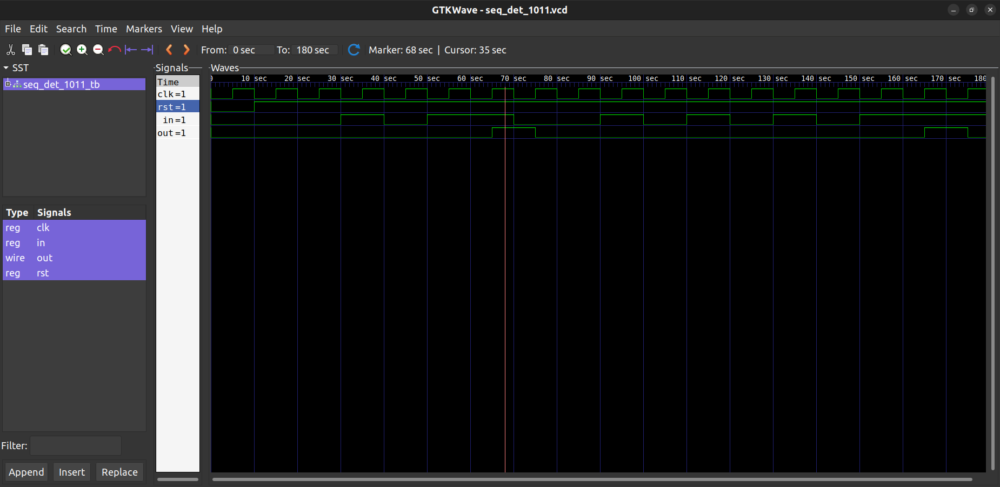

# Overlappin Mealy Sequence Detector

This project implements a sequence detector using a Mealy finite state machine (FSM) in Verilog. The detector continuously monitors a serial input stream and asserts the output when the sequence "1011" is detected.

Overlapping sequences are supported.

Designed and verified with a Verilog testbench and waveform simulation.

 # *Folder Structure*

Sequence-det/
 ├── src/
 │    └── seq_det_1011.v          # Verilog module
 ├── tb/
 │    └── seq_det_1011_tb.v       # Testbench
 ├── waveforms/
 │    └── seq_det_1011.vcd       # VCD output (generated post-simulation) 
 │    └── seq_det_1011_waveform.png       # Screenshot from GTKWave
 ├── README.md

FSM Design – Mealy Machine
Sequence to Detect: 1011

FSM Type: Mealy (Output depends on current state and input)

Supports: Overlapping sequences
Example:
Input: 1 0 1 1 0 1 1
Output triggers on both 1011 sequences.

### State Transitions

<<<<<<< HEAD
| **Current State** | **Input** | **Next State** | **Output** |
|-------------------|-----------|----------------|------------|
| S0                | 1         | S1             | 0          |
| S0                | 0         | S0             | 0          |
| S1                | 0         | S2             | 0          |
| S1                | 1         | S1             | 0          |
| S2                | 0         | S0             | 0          |
| S3                | 1         | S1             | 1          |
| S3                | 0         | S2             | 0          |
=======
State	Input	Next State	Output
 S0    	1	S1	        0
 S0	0	S0             	0
 S1	0	S2	        0
 S1	1	S1	        0
 S2	1	S3      	0
 S2	0	S0      	0
 S3	1	S4      	0
 S3	0	S2      	0
 S4     1       S1              1
 S4     0       S2              0
>>>>>>> b170b8e (Updated Sequence Detector)

# How to Run

 Simulation (using Icarus Verilog + GTKWave)

Compile:
iverilog -o seq_det_1011.vvp -v tb/seq_det_1011_tb.v src/seq_det_1011.v

Simulate:
vvp seq_det_1011.vvp

View Waveform:
gtkwave seq_det_1011.vcd

# Expected Output

Given an input stream:
1 0 1 1 0 1 1

The output will be 0 0 0 1 0 0 1, indicating detection at the 4th and 7th bits.

# Sample Output Waveform

> Waveform showing operation of Sequence Detector

